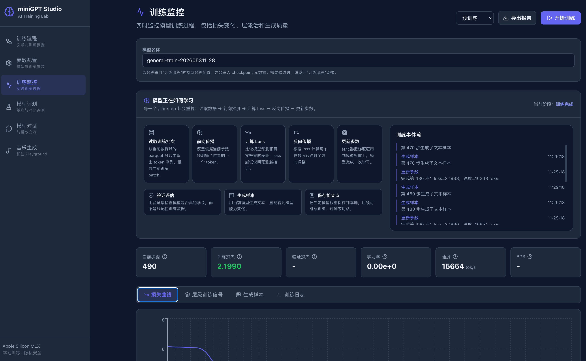

# miniGPT Studio

在 Apple Silicon 上使用 MLX 本地构建、训练、评估和演示小型 GPT 模型。



## 项目初衷

miniGPT Studio 起源于一个想法：在 MacBook 上从零训练一个聊天机器人，不依赖 PyTorch，也不需要云端 GPU。它保留了受 Karpathy nanochat 启发的轻量级 MLX 训练流水线，并在此基础上扩展了 React Studio、音乐领域数据处理能力，以及交互式 Music Playground。

## 这是什么？

这是一个完全运行在 Apple Silicon 本地环境中的 GPT 训练工作室。一个复杂度参数 `--depth` 控制所有关键设置：模型规模、学习率、批大小和训练时长。完整流程覆盖从原始数据准备到可用聊天机器人或音乐和弦生成器，无需 PyTorch。

- 单一复杂度旋钮：`--depth` 会自动设置所有超参数
- 完整流水线：数据下载、分词器训练、预训练、SFT、聊天和评估
- React Studio：提供训练监控、参数配置、模型评估、聊天和音乐生成界面
- Quickstart 向导：`uv run python -m scripts.quickstart` 可快速跑通训练流程
- Music Playground：基于音乐 checkpoint 生成和弦时间线，通过 Web Audio 试听，并导出 MIDI
- 无 PyTorch 依赖，除非你要导入预训练 checkpoint

## 快速开始

你可以为每条命令使用 `uv run`，也可以先激活一次虚拟环境。

### 推荐方式：启动完整 miniGPT Studio

完整 miniGPT Studio 由后端 API 和 React 前端组成，需要在两个终端中分别启动。以下命令默认从项目根目录运行。

终端一：启动后端 API。

```bash
git clone <your-miniGPT-Studio-repo-url>
cd minigpt-studio
uv sync
uv run uvicorn scripts.training_api:app --host 127.0.0.1 --port 8000
```

终端二：启动 React 前端。

```bash
cd web
npm install
npm run dev -- --host 127.0.0.1
```

然后打开 Vite 输出的前端地址：

- miniGPT Studio：<http://127.0.0.1:3000/>
- Music Playground：<http://127.0.0.1:3000/music>
- 后端状态：<http://127.0.0.1:8000/api/status>

如果 `3000` 端口被占用，Vite 通常会自动切换到 `3001`，请以终端输出的地址为准。

在 README 后续内容中，请根据你的环境选择命令风格：如果没有激活虚拟环境，就保留 `uv run python -m ...`；如果已经激活 `.venv`，则可以去掉 `uv run`。

### 可选方式：快速向导

`scripts.quickstart` 会启动一个轻量级向导页面，适合快速跑通数据下载、分词器训练、模型训练、SFT 和聊天流程。它不是完整 React 版 miniGPT Studio 前端。

```bash
uv run python -m scripts.quickstart
```

然后在浏览器中打开 <http://127.0.0.1:8000>。

如果你已经激活 `.venv`，也可以运行：

```bash
python -m scripts.quickstart
```

### 停止服务

在对应终端中按 `Ctrl+C` 可以停止任意一个服务。如果同时启动了后端和前端，需要分别停止两个终端中的进程。

## 导入预训练模型

如果想跳过训练，可以直接从 HuggingFace 导入预训练模型：

```bash
uv sync --extra convert   # 添加用于 checkpoint 转换的 torch 依赖
uv run python -m scripts.convert_from_hf --repo nanochat-students/base-d20
```

如果已经激活 `.venv`，同样的命令可以写成 `python -m scripts.convert_from_hf --repo nanochat-students/base-d20`。

也可以使用 GUI：运行 `uv run python -m scripts.quickstart`，或在已激活 `.venv` 的环境中运行 `python -m scripts.quickstart`，然后在训练步骤中点击“Import from HuggingFace”。

## 完整流水线（CLI）

如果想完全手动控制，可以逐步运行每个阶段：

本节示例默认已经激活 `.venv`。如果你没有激活虚拟环境，请在每条 `python -m ...` 命令前加上 `uv run`。

```bash
# 1. 下载数据，至少 2 个 shard，确保存在 train/val 切分
python -m nanochat_mlx.dataset -n 2

# 2. 训练 BPE 分词器，词表大小为 32768
python -m scripts.tok_train

# 3. 训练基础模型，depth=4 适合快速测试
python -m scripts.train --depth=4

# 4. 监督微调
python -m scripts.sft --depth=4

# 5. 与你的模型聊天
python -m scripts.chat --depth=4 --source=sft --interactive

# 6. 评估
python -m scripts.chat_eval --depth=4
```

也可以使用 quickstart 脚本一次性运行完整流程：

```bash
bash runs/quickstart.sh
```

如果没有激活 `.venv`，请使用 `uv run bash runs/quickstart.sh` 运行该脚本。

## Depth 复杂度旋钮

`--depth` 参数是项目中的单一复杂度旋钮。其他所有超参数，包括宽度、注意力头数、批大小、学习率和训练 token 数，都会根据 depth 按缩放规律自动计算。

| Depth | 参数量    | 时间（M3 Pro） | 适用场景        |
| ----- | ------ | ---------- | ----------- |
| 4     | \~5M   | \~1 分钟     | 快速测试、调试     |
| 12    | \~125M | \~1 小时     | 可用质量        |
| 20    | \~350M | \~8 小时     | 较好质量        |
| 26    | \~600M | \~24 小时    | 复现 GPT-2 规模 |

“miniseries principle” 要求任何架构改动都能在所有 depth 上正常工作。

## 应该使用哪款 Mac？

下面是面向硬件兼容性问题的实用起点。实际运行时间会受到散热、数据 shard 数量、后台内存压力，以及是从零训练还是导入 checkpoint 等因素影响。

| Mac                  | 推荐 depth                      | 预期时间                           | 已知注意事项                                                 |
| -------------------- | ----------------------------- | ------------------------------ | ------------------------------------------------------ |
| 8 GB 统一内存的 M1        | Depth 4                       | 几分钟                            | 最适合冒烟测试、调试和验证流水线是否可运行。建议保持较低 shard 数量。                 |
| 16 GB 统一内存的 M1/M2    | Depth 12                      | 约 1-2 小时                       | 适合作为真实训练的入门路径。训练前建议关闭占用内存较高的应用。                        |
| 24 GB 统一内存的 M3/M4    | Depth 12 较轻松；Depth 20 可作为过夜任务 | Depth 12 约 1 小时；Depth 20 需要数小时 | 建议先用 Depth 4 验证，再逐步扩大。Depth 20 可能需要减小 batch 或减少其他应用占用。 |
| 32 GB+ Apple Silicon | Depth 20+                     | Depth 20 约 8 小时；Depth 26 约一天   | 最适合完整质量的本地实验。Depth 26 仍然是一次较长训练。                       |

## 硬件要求

必须使用 Apple Silicon（M1、M2、M3、M4 任意型号）。

按 depth 推荐的内存：

- **8 GB**：depth 4，适合快速测试和调试
- **16 GB**：depth 12，适合较合理质量的训练
- **32 GB+**：depth 20 及以上，适合较好到完整质量的训练

对于 24 GB Apple Silicon 笔记本，推荐的冒烟测试路径是使用 depth 4，设置较低内存上限，并使用 2-4 个 shard。

<br />

## 项目结构

```text
nanochat_mlx/          MLX 核心模块
  gpt.py               GPT Transformer 模型
  optim.py             Muon+AdamW 优化器
  engine.py            带 KV cache 的推理
  train.py             训练循环
  sft.py               SFT 流水线
  eval.py              BPB 评估
  dataloader.py        BOS 对齐的 best-fit packing
  sft_dataloader.py    SFT 对话 packing
  dataset.py           数据下载和迭代
  tokenizer.py         BPE 分词器
  common.py            内存管理和工具函数
scripts/               入口脚本
  quickstart.py        Web GUI 向导
  train.py             训练 CLI
  sft.py               SFT CLI
  chat.py              聊天 CLI
  chat_eval.py         评估 CLI
  tok_train.py         分词器训练
  convert_from_hf.py   HuggingFace checkpoint 导入
tasks/                 评估任务，包含 ARC、MMLU、GSM8K 等
tests/                 测试套件
runs/                  Shell 脚本
```

## 测试

激活 `.venv` 后运行：

```bash
python -m pytest tests/ -v                    # 运行全部测试
python -m pytest tests/ -v -m "not slow"      # 跳过慢测试
```

如果没有激活 `.venv`，请在这些命令前加上 `uv run`。

测试会使用 mock 类来避免加载真实模型。未安装 `mlx` 时，MLX 相关测试会被跳过。

## 致谢

本项目基于 [Karpathy nanochat](https://github.com/karpathy/nanochat)，原始架构、训练配方和缩放规律洞察均归功于 nanochat 项目及其贡献者。
